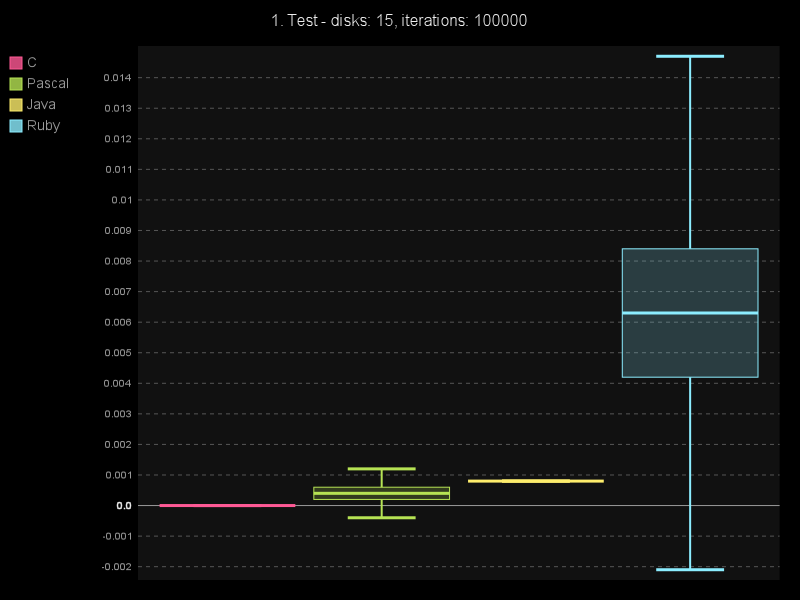
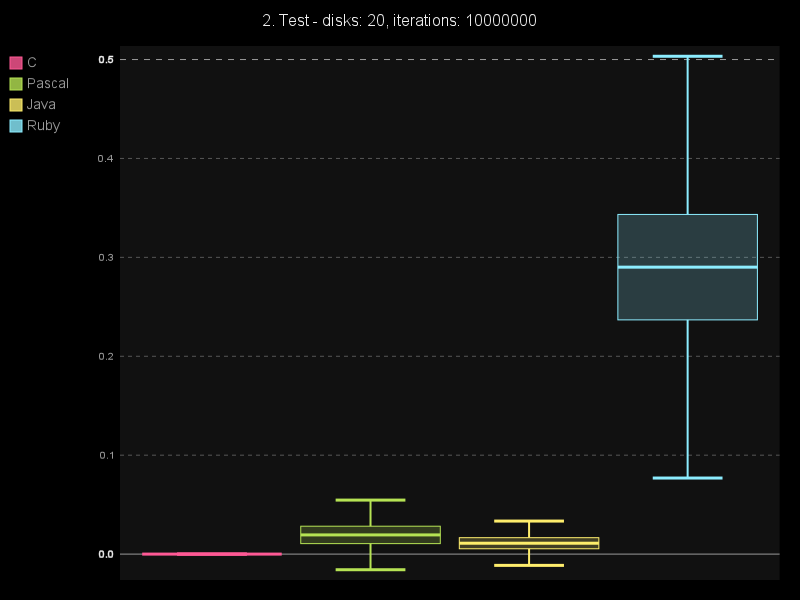
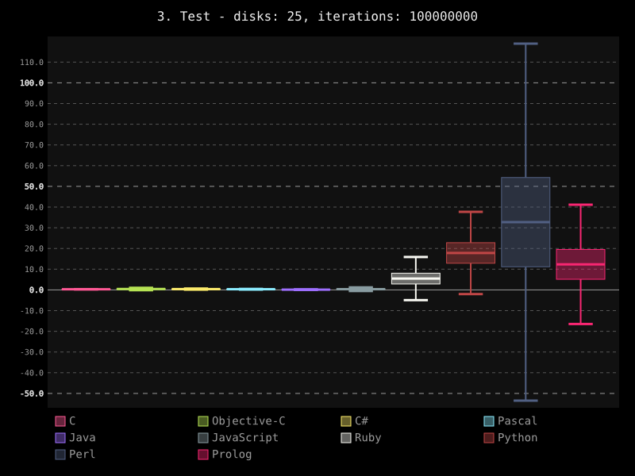
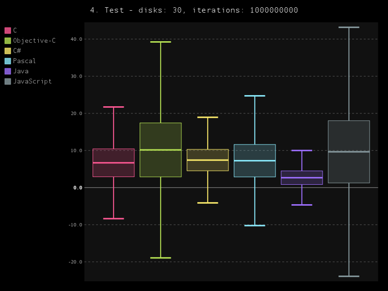

# LangBenchmarks

This project is supposed for all people who are interested in difference
between performance for several programming languages. It can also serve
to compare syntax of many languages. As a bonus some functional a logical
programming languages are included as well. 

At now benchmark supports:

  * C
  * Objective-C
  * C#
  * Java
  * Pascal
  * JavaScript
  * PHP
  * Ruby
  * Python
  * Perl
  * Bash
  * Prolog
  * Common Lisp

More languages like Lua, Haskell, Scala, Clojure are comming soon...

If you have idea how to improve this script, or which language to add, feel
free to commit it :)

## Benchmark overview

Evaluation was simple. Two performance tests are written in several programming
languages and their computation speed is compared.

### Cycle test

This test evaluated speed of code in simple loop with variable iterations with
while clause.

```python
def cycle(n):
    i = 0
    while i < n:
        i += 1;
```

### Hanoi test

Test for extended recursion to solving Hanoi towers puzzle. To make it more
complex, six sticks are used instead of three with variable count of discs.

```python
def hanoi(n, start, dest, sticks):
    if n == 0:
        return
    
    temp = sticks - start - dest
    hanoi(n - 1, start, temp, sticks)
    hanoi(n - 1, temp, dest, sticks)
```

## Installation

Simply clone this repository. To set proper configuration for evaluated
languages, you need to edit `config.py` module located in `evaluator` package.

## Results

Here are my results obtained on my Apple Machine. Reason I used Apple was
environment, where I could use together C# (through Mono), Objective-C,
Bash and where I would use Swift in future.

### Environment

| Info |  |
| :-----: | :-----: |
| Operating System | Darwin-13.2.0-x86_64-i386-64bit |
| Processor | i386 |
| Total memory | 2.000GB |

### Compilers & Interpreters

| Language | Available Version |
| :-----: | :-----: |
| C | Apple LLVM version 5.1 (clang-503.0.40) (based on LLVM 3.4svn) |
| Objective-C | Apple LLVM version 5.1 (clang-503.0.40) (based on LLVM 3.4svn) |
| C# | Mono C# compiler version 3.4.0.0 |
| Pascal | Free Pascal Compiler version 2.6.4 [2014/02/26] for i386 |
| Java | javac 1.8.0_05 |
| JavaScript (node.js) | v0.10.29 |
| PHP | PHP 5.5.13 (cli) (built |  May 30 2014 10 | 43 | 29) |
| Ruby | ruby 2.0.0p451 (2014-02-24 revision 45167) [universal.x86_64-darwin13] |
| Python | Python 3.4.1 |
| Perl | This is perl 5, version 16, subversion 3 (v5.16.3) built for darwin-thread-multi-2level |
| Bash | GNU bash, version 3.2.51(1)-release (x86_64-apple-darwin13) |
| Prolog | SWI-Prolog version 6.6.6 for x86_64-darwin13.1.0 |
| Common Lisp | GNU CLISP 2.49 (2010-07-07) (built 3612292961) (memory 3612293171) |

### Performance Tests

In performance tests, scripts were executed 5 times with 120 seconds timeout.
After this timeout script was killed. After executions, their times average
value were computed together with standard deviation. This values was used
to construct tables and graphs.
#### Test 1. - Discs 15, Iterations 1000000
    
| Lang | Avg. cycles | Std. cycles | Avg. hanoi | Std. hanoi |
| :-----: | :-----: | :-----: | :-----: | :-----: |
| C | 0.003s | 14.41% | 0.000s | 0.00% |
| Objective-C | 0.003s | 0.00% | 0.001s | 0.00% |
| C# | 0.004s | 0.00% | 0.000s | 0.00% |
| Pascal | 0.002s | 22.22% | 0.000s | 200.00% |
| Java | 0.003s | 23.53% | 0.002s | 30.62% |
| JavaScript | 0.002s | 30.62% | 0.002s | 22.22% |
| PHP | 0.155s | 1.66% | 0.122s | 1.47% |
| Ruby | 0.028s | 1.44% | 0.008s | 0.00% |
| Python | 0.123s | 0.32% | 0.022s | 0.00% |
| Perl | 0.114s | 1.70% | 0.052s | 0.95% |
| Bash | 26.226s | 2.24% | 4.284s | 1.50% |
| Prolog | 0.052s | 0.95% | 0.006s | 18.26% |
| Common Lisp | 1.345s | 1.48% | 0.120s | 4.18% |




#### Test 2. - Discs 20, Iterations 10000000
    
| Lang | Avg. cycles | Std. cycles | Avg. hanoi | Std. hanoi |
| :-----: | :-----: | :-----: | :-----: | :-----: |
| C | 0.029s | 2.60% | 0.010s | 0.00% |
| Objective-C | 0.029s | 2.60% | 0.017s | 4.35% |
| C# | 0.046s | 2.12% | 0.010s | 9.61% |
| Pascal | 0.031s | 17.12% | 0.012s | 3.39% |
| Java | 0.011s | 3.70% | 0.006s | 0.00% |
| JavaScript | 0.013s | 3.12% | 0.019s | 3.90% |
| PHP | 1.605s | 2.14% | 4.058s | 2.19% |
| Ruby | 0.283s | 1.59% | 0.252s | 4.62% |
| Python | 1.261s | 1.48% | 0.724s | 1.19% |
| Perl | 1.155s | 1.19% | 1.671s | 2.43% |
| Bash | Dead | Dead | Dead | Dead |
| Prolog | 0.517s | 1.58% | 0.601s | 1.20% |
| Common Lisp | 13.455s | 1.74% | 3.776s | 0.96% |




#### Test 3. - Discs 25, Iterations 100000000
    
| Lang | Avg. cycles | Std. cycles | Avg. hanoi | Std. hanoi |
| :-----: | :-----: | :-----: | :-----: | :-----: |
| C | 0.288s | 1.13% | 0.319s | 0.70% |
| Objective-C | 0.286s | 0.49% | 0.547s | 2.43% |
| C# | 0.456s | 2.70% | 0.320s | 1.51% |
| Pascal | 0.288s | 3.30% | 0.354s | 1.38% |
| Java | 0.085s | 1.15% | 0.157s | 0.51% |
| JavaScript | 0.126s | 2.93% | 0.573s | 5.38% |
| PHP | Dead | Dead | Dead | Dead |
| Ruby | 2.817s | 0.98% | 7.905s | 1.22% |
| Python | 12.527s | 0.45% | 22.872s | 0.64% |
| Perl | 11.426s | 0.43% | 53.738s | 1.41% |
| Bash | Dead | Dead | Dead | Dead |
| Prolog | 5.159s | 0.44% | 20.209s | 1.29% |
| Common Lisp | Dead | Dead | Dead | Dead |




#### Test 4. - Discs 30, Iterations 1000000000
    
| Lang | Avg. cycles | Std. cycles | Avg. hanoi | Std. hanoi |
| :-----: | :-----: | :-----: | :-----: | :-----: |
| C | 2.913s | 1.70% | 10.434s | 1.50% |
| Objective-C | 2.881s | 0.70% | 17.424s | 0.85% |
| C# | 4.526s | 0.05% | 10.290s | 0.19% |
| Pascal | 2.873s | 0.81% | 11.610s | 0.57% |
| Java | 0.831s | 1.92% | 4.497s | 0.65% |
| JavaScript | 1.256s | 1.53% | 18.026s | 1.38% |
| PHP | Dead | Dead | Dead | Dead |
| Ruby | Dead | Dead | Dead | Dead |
| Python | Dead | Dead | Dead | Dead |
| Perl | Dead | Dead | Dead | Dead |
| Bash | Dead | Dead | Dead | Dead |
| Prolog | Dead | Dead | Dead | Dead |
| Common Lisp | Dead | Dead | Dead | Dead |




